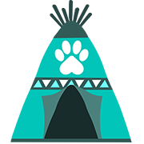

<hr />
<div align="center">
    
</div>
<hr />

# Paw Tribes

The perfect tool for Paw tribes lists and network statistics.

## What is Paw?

Paw is a animal themed digital currency. More information is available over on the official [Paw repository](https://github.com/paw-digital/paw-node).

## Prerequisites

- Webserver like nginx as a reverse proxy
- MongoDB
- Nano Node with RPC enabled
- Node.js
- PM2 `npm install pm2 -g`

## Installation

Clone the repository to your server and install the dependencies with `npm i`.

After that copy the `ecosystem.config.sample.js` as `ecosystem.config.js` and edit the environment variables accordingly.

To start up the application execute `pm2 start ecosystem.config.js`.

It is recommended to put the application behind a proper webserver like nginx, a configuration for that could look like this:

```nginx
server {
        listen 80;
        listen [::]:80;

        server_name mynano.ninja;

        // location to your MyNanoNinja
        location / {
                proxy_pass http://127.0.0.1:4000;
        }

        // location to your accept-nano instance
        location /payment/ {
                rewrite ^/payment(/.*)$ $1 break;
                proxy_pass         http://127.0.0.1:5000;
        }
}
```

## Open Source Licenses

This product includes GeoLite2 data created by MaxMind, available from <a href="http://www.maxmind.com">http://www.maxmind.com</a>.
